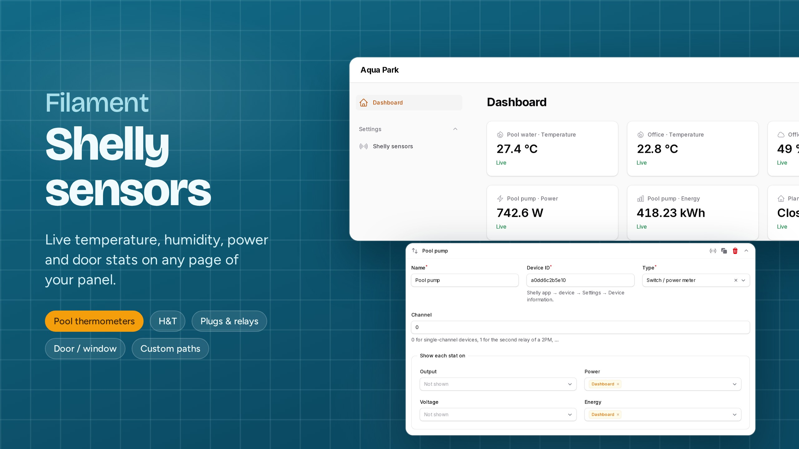
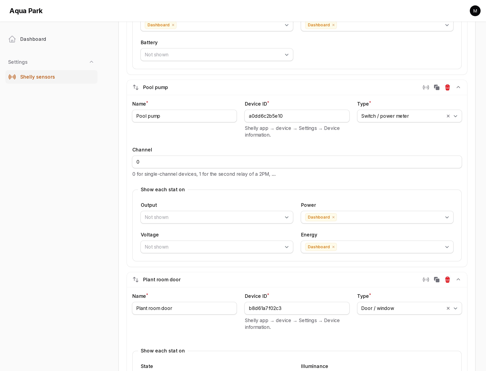
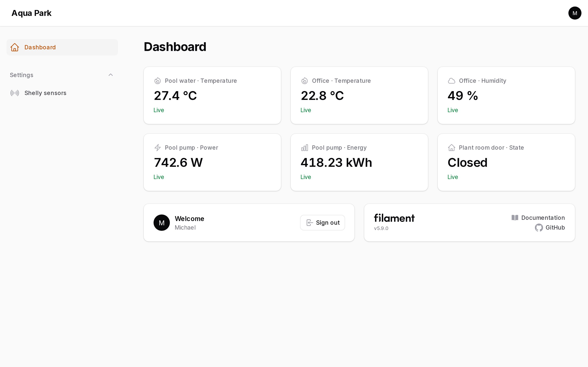

# Filament Shelly

[](https://packagist.org/packages/daedaloslabs/filament-shelly)
[](https://github.com/daedaloslabs/filament-shelly/actions)

Show live [Shelly](https://www.shelly.com) sensor values as stat widgets on **any** Filament page: a pool thermometer on the dashboard, a fridge's humidity on an inventory page, a pump's power draw on a maintenance resource.

Add as many sensors as you want from a settings page, choose each sensor's type, then decide **per stat** on which pages it appears. You don't have to write a widget or touch your pages.



## Features

- **Settings page** with a repeater: add, reorder, clone and test any number of Shelly devices.
- **Sensor types** that know what each device reports, for both Gen1 and Gen2+/Gen3 devices:
  | Type | Stats |
  |---|---|
  | Temperature probe (pool, water, pipe; DS18B20 on Plus Add-on, …) | temperature |
  | Humidity & temperature (H&T Gen1, Plus, Gen3) | temperature, humidity, battery |
  | Switch / power meter (1PM, 2PM, Plug S, PM Mini, Pro…) | output, power, voltage, energy |
  | Door / window (DW2, BLU DW) | state, illuminance, battery |
  | **Custom** | any value from the device status JSON, with your own labels and units |
- **Per-stat placement**: every stat has its own "show on pages" picker listing all pages of the panel, including resource pages.
- **Light on requests**: one Shelly Cloud request covers up to 10 devices, every status is cached (failures too), and Shelly's 1 request/second limit is respected.
- **"Test" button** for each sensor that shows the live values and the device's available components, so you can find the right path for custom stats.
- **Extensible**: add your own sensor types in one small class.
- The auth key is stored **encrypted**. English and Greek translations are included.

## Requirements

- PHP 8.2+
- Filament 5.x
- A Shelly Cloud account with its devices

## Installation

```bash
composer require daedaloslabs/filament-shelly
php artisan filament-shelly:install
```

The install command publishes and runs the migration, which creates the `shelly_accounts` and `shelly_sensors` tables. If you'd rather do it by hand:

```bash
php artisan vendor:publish --tag="filament-shelly-migrations"
php artisan migrate
```

> **Multi-tenant apps (one database per tenant):** move the published migration into your tenant migrations folder. Each tenant then gets its own Shelly account and sensors.

Register the plugin in your panel provider:

```php
use DaedalosLabs\FilamentShelly\ShellyPlugin;

public function panel(Panel $panel): Panel
{
    return $panel
        // ...
        ->plugin(ShellyPlugin::make());
}
```

If your panel uses a [custom theme](https://filamentphp.com/docs/5.x/styling/overview#creating-a-custom-theme), you don't need to change anything. The plugin only uses Filament's own components.

## Usage

1. Open **Shelly sensors** in the panel navigation.
2. Copy the **server** and **authorization cloud key** from the Shelly app or [control.shelly.cloud](https://control.shelly.cloud): *User settings → Authorization cloud key*.
3. Click **Add sensor**, then enter a name and the **Device ID** (*device → Settings → Device information*) and pick a **type**.
4. Under **Show each stat on**, choose the pages where each stat should appear. Leave a stat empty to hide it.
5. Click **Test** to confirm that the device answers, then **Save**.

The stats appear at the top of the chosen pages and refresh on their own.





### Custom sensors

Choose **Custom** and add one row per stat, with a label, a dot path inside the device status, and an optional unit:

| Label | Status path | Unit |
|---|---|---|
| Pool water | `temperature:100.tC` | °C |
| Pump power | `switch:0.apower` | W |
| WiFi signal | `wifi.rssi` | dBm |

Not sure which path to use? Click **Test** on the sensor. The notification lists the device's components (`temperature:100`, `switch:0`, `wifi`, …).

## Configuration

All options are optional:

```php
ShellyPlugin::make()
    // Reuse a device status for N seconds before asking Shelly Cloud again (default 60).
    ->cacheFor(120)

    // How often the widgets refresh in the browser (default '60s', null = never).
    ->pollingInterval('30s')

    // Where the stats render on each page: any Filament\View\PanelsRenderHook constant.
    // Default: PanelsRenderHook::PAGE_HEADER_WIDGETS_BEFORE
    ->renderHook(\Filament\View\PanelsRenderHook::PAGE_FOOTER_WIDGETS_AFTER)

    // Navigation of the settings page.
    ->navigationGroup('Settings')
    ->navigationSort(90)

    // Who can manage sensors (default: everyone who can access the panel).
    ->authorize(fn (): bool => auth()->user()->is_admin)

    // Add your own sensor types (see below). Use merge: false to drop the built-in ones.
    ->sensorTypes([SoilMoisture::class])
```

### Placing the widget by hand

The stats are injected automatically through a render hook. To place them yourself instead, for example between other widgets, add the widget to a page and pass that page's class:

```php
use DaedalosLabs\FilamentShelly\Widgets\ShellyStatsWidget;

protected function getHeaderWidgets(): array
{
    return [
        ShellyStatsWidget::make(['page' => static::class]),
    ];
}
```

> If you place it by hand, set `->renderHook()` to a hook your page doesn't render, or the stats will show twice.

## Adding a sensor type

A sensor type tells the plugin which **metrics** a device reports and where to find them in the status JSON. Extend `SensorType`:

```php
namespace App\Shelly;

use Filament\Forms\Components\TextInput;
use DaedalosLabs\FilamentShelly\SensorTypes\Metric;
use DaedalosLabs\FilamentShelly\SensorTypes\SensorType;

class Flood extends SensorType
{
    public function key(): string
    {
        return 'flood'; // stored in the database, never change it
    }

    public function label(): string
    {
        return 'Flood sensor';
    }

    public function metrics(array $options): array
    {
        return [
            new Metric(
                key: 'flood',
                label: 'Water leak',
                paths: ['flood:0.alarm', 'flood'],        // first path that exists wins (Gen2+, then Gen1)
                icon: 'heroicon-o-exclamation-triangle',
                format: fn (bool $alarm): string => $alarm ? 'Leak!' : 'Dry',
            ),
            new Metric('battery', 'Battery', ['devicepower:0.battery.percent', 'bat.value'], unit: '%', decimals: 0),
        ];
    }

    // Optional extra fields per sensor, saved in $options. Use ->live(onBlur: true) if metrics() reads them.
    public function form(): array
    {
        return [];
    }
}
```

Then register it:

```php
ShellyPlugin::make()->sensorTypes([\App\Shelly\Flood::class]);
```

`Metric` options:

| Argument | Meaning |
|---|---|
| `key` | Stable id, used to store the placement. |
| `label` | Stat label. |
| `paths` | Candidate dot paths into the status. The first non-null one wins. |
| `unit` | Appended to the value. |
| `icon` | Any Blade icon name. |
| `decimals` | Rounds numbers. `null` shows the raw value. Default `1`. |
| `format` | `fn (mixed $value): string` for full control. |

## How requests are kept low

- Statuses come from the Shelly Cloud Control API v2 (`/v2/devices/api/get`), so **one request covers up to 10 devices**.
- Each device status is cached for `cacheFor()` seconds. The cache key includes the credentials, so tenants never share data.
- Failures and unknown devices are cached as well, so a broken key or an offline cloud is not retried on every page load.
- HTTP 429 responses are retried, and when more than 10 devices are on one page, the batches are sent 1 second apart to respect Shelly's rate limit.
- The widget is lazy-loaded, and it isn't rendered at all on pages that have no stats placed on them.

## Testing

```bash
composer test
```

## Changelog

See [CHANGELOG](CHANGELOG.md).

## Credits

- [Michael Mavroforakis](https://github.com/long-blade)
- [Daedalos Labs](https://github.com/daedaloslabs)

## License

The MIT License (MIT). See [License File](LICENSE.md).
